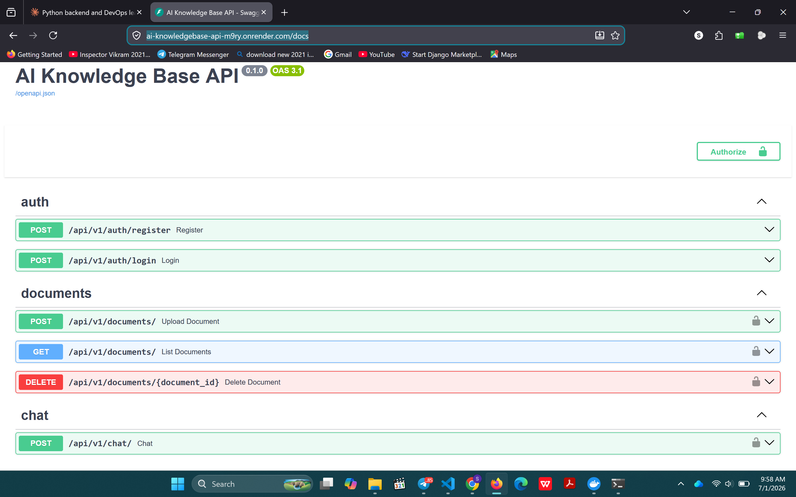
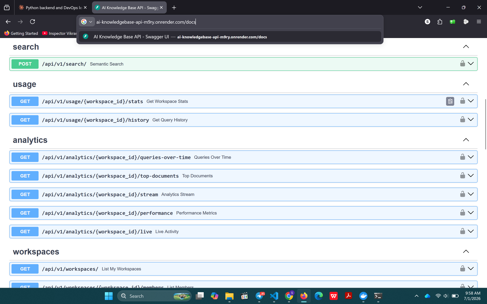
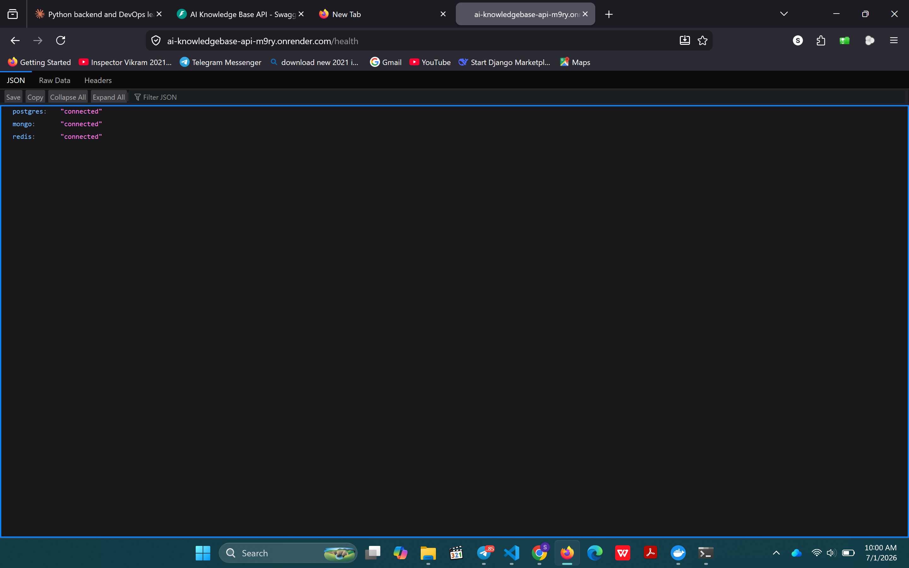

# AI Knowledge Base API


[](https://github.com/andugetachew/ai-knowledgebase-api/actions)
[](https://github.com/andugetachew/ai-knowledgebase-api/blob/main/postman_collection.json)

> AI-powered document knowledge base backend supporting document ingestion, semantic search, team collaboration, and conversational Q&A.

## 🌐 Live

| | URL |
|--|--|
| **API** | https://ai-knowledgebase-api-m9ry.onrender.com |
| **Docs** | https://ai-knowledgebase-api-m9ry.onrender.com/docs |
| **Health** | https://ai-knowledgebase-api-m9ry.onrender.com/health |

> ⚠️ Hosted on Render free tier — first request may take 50 seconds to wake up.


## 🚀 What it does

Users upload documents (PDF, DOCX, CSV, URLs). The API extracts text, chunks it, generates embeddings, and stores them in MongoDB. Users then ask questions in natural language — the API retrieves relevant chunks and sends them to Claude AI to generate an answer, with full multi-turn conversation memory.

Teams collaborate through workspaces with role-based access (owner/editor/viewer). Usage is rate-limited per plan (free: 10 queries/day, pro: 10,000/day) with Stripe handling plan upgrades.

---

## 🛠 Tech Stack

| Layer | Technology |
|-------|-----------|
| Framework | FastAPI (fully async) |
| SQL DB | PostgreSQL + SQLAlchemy + Alembic |
| NoSQL DB | MongoDB (Motor async) |
| Cache & Queue | Redis + Celery |
| AI | Anthropic Claude API |
| Embeddings | sentence-transformers |
| Payments | Stripe (checkout + webhooks) |
| Email | Gmail SMTP |
| File Storage | S3-compatible (boto3) |
| Containers | Docker + docker-compose |
| CI/CD | GitHub Actions + Docker Hub |
| Monitoring | Prometheus + Sentry + UptimeRobot |

---

## 📸 Screenshots

### Swagger UI



### Health Check


---

## 📡 API Endpoints

| Resource | Base Endpoint |
|----------|---------------|
| Authentication | `/api/v1/auth/*` |
| Documents | `/api/v1/documents/*` |
| Chat | `/api/v1/chat/*` |
| Search | `/api/v1/search/*` |
| Workspaces | `/api/v1/workspaces/*` |
| Billing | `/api/v1/subscription/*`, `/api/v1/checkout/*` |
| Analytics | `/api/v1/analytics/*` |
| Usage | `/api/v1/usage/*` |
| Admin | `/api/v1/admin/*` |
| Monitoring | `/health`, `/metrics` |

> 📖 Full interactive API documentation is available at `/docs`.

---

## 🧪 Testing

```bash
pytest -v
pytest --cov=app --cov-report=term-missing
```

**210 tests, 93% coverage** across auth, documents, chat, search, analytics, billing, email, storage, WebSocket, and Celery tasks.

---

## 🎯 Notable Engineering Decisions

**Atomic rate limiting** — uses Redis `INCR` to eliminate TOCTOU race conditions. A concurrent regression test (20 simultaneous requests against a limit of 10) proves exactly 10 are always allowed.

**Celery failure handling** — broker outage at upload time marks the document `failed` and returns 503, preventing orphaned `pending` rows with no recovery path.

**LLM error isolation** — Anthropic failures (429/529/timeout) are caught in the service layer and returned as 502 Bad Gateway with human-readable messages.

**Redis password reset tokens** — stored with TTL via `setex`, one-time use, survive server restarts.

## ⚙️ Quick Start

```bash
git clone https://github.com/andugetachew/ai-knowledgebase-api
cd ai-knowledgebase-api

cp .env.example .env.docker
# Fill in your credentials

docker compose up -d
docker compose exec api alembic upgrade head
```

Once the application is running:

- API: `http://localhost:8000`
- Docs: `http://localhost:8000/docs`
- Health: `http://localhost:8000/health`

---

## ✨ Features

- JWT authentication with workspace isolation
- AI-powered document Q&A using Claude
- PDF, DOCX, CSV, TXT, and URL ingestion
- Semantic search with vector embeddings
- Multi-turn conversation memory
- Team workspaces with role-based access
- Stripe subscription billing
- Background processing with Celery
- WebSocket streaming
- 210 automated tests with 93% code coverage

## 🔑 Key Environment Variables

```env
DATABASE_URL=postgresql+asyncpg://...
MONGO_URL=mongodb+srv://...
REDIS_URL=redis://...
ANTHROPIC_API_KEY=sk-ant-...
STRIPE_SECRET_KEY=sk_test_...
EMAIL_HOST_USER=your@gmail.com
S3_ENDPOINT_URL=http://...
SENTRY_DSN=https://...
```

---

## 📄 License

MIT

## 👨‍💻 Author

**Andualem Getachew**

[](https://github.com/andugetachew)
[](mailto:andugeta41@gmail.com)